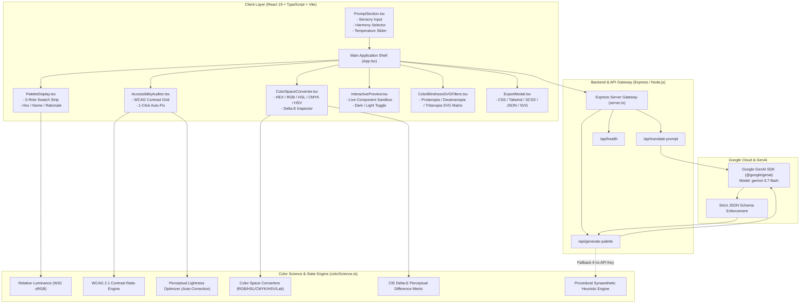
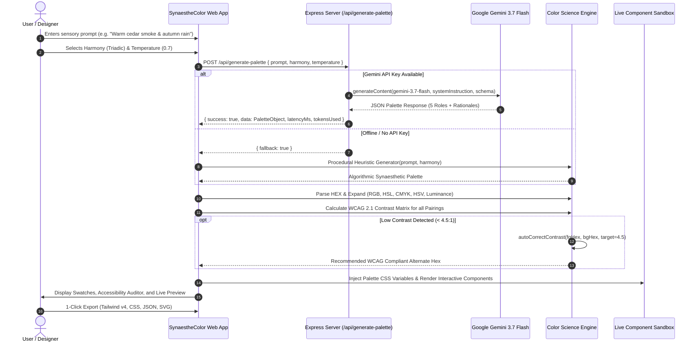

<div align="center">

# 🌈 SynaestheColor

### AI-Powered Emotional & Scene Synaesthesia Color Palette Studio with Real-Time WCAG 2.1 Accessibility Auditing

[](https://github.com/sepas1609/SynaestheColor/actions)
[](https://opensource.org/licenses/MIT)
[](https://deepmind.google/technologies/gemini/)
[](https://react.dev/)
[](https://www.typescriptlang.org/)
[](https://tailwindcss.com/)
[](https://www.w3.org/WAI/standards-guidelines/wcag/)
[](./CONTRIBUTING.md)

<p align="center">
  <b>Translate evocative scenes, emotional poetry, and cross-sensory memories into harmonized 5-role design token systems with mathematically validated accessibility.</b>
</p>

---

</div>

## 📖 Table of Contents

- [✨ Overview & Philosophy](#-overview--philosophy)
- [🚀 Key Features](#-key-features)
- [📐 System Architecture](#-system-architecture)
- [🔄 Interactive Data Flowchart](#-interactive-data-flowchart)
- [🔬 Color Science & WCAG Mathematics](#-color-science--wcag-mathematics)
- [⚡ 5-Role Semantic Token System](#-5-role-semantic-token-system)
- [💻 Getting Started](#-getting-started)
- [🔌 API Endpoints](#-api-endpoints)
- [📦 Multi-Format Developer Exports](#-multi-format-developer-exports)
- [📂 Project Directory Structure](#-project-directory-structure)
- [🤝 Contributing](#-contributing)
- [📜 License](#-license)

---

## ✨ Overview & Philosophy

**Synaesthesia** is a neurological phenomenon where stimulation of one sensory or cognitive pathway leads to involuntary experiences in a second pathway (e.g., *tasting words*, *hearing colors*, or *feeling the temperature of a visual mood*).

**SynaestheColor** bridges cognitive synaesthesia and software engineering by transforming vivid prose (e.g., *"An abandoned Victorian greenhouse overgrown with glowing bioluminescent moss at dusk"*) into cohesive, production-ready digital color systems. Powered by **Google Gemini 3.7 Flash**, the engine interprets sensory triggers, temperature, and lighting to generate structured design tokens mapped to strict semantic roles, backed by real-time **WCAG 2.1 contrast compliance**, **color blindness matrices**, and **1-click auto-correction**.

```
"Neon rain on cybernetic asphalt in Neo-Tokyo"
                      ↓
  [ Primary: Cyan #00F0FF ]  [ Accent: Magenta #FF007F ]  [ Background: Obsidian #090D16 ]
```

---

## 🚀 Key Features

| Capability | Description |
| :--- | :--- |
| **🧠 Gemini 3.7 Flash Engine** | Generates 5 distinct color tokens with poetic rationales, psychological context, and sensory tags via Gemini structured JSON schema. |
| **♿ WCAG 2.1 AAA/AA Matrix** | Evaluates real-time relative luminance ($L$) and contrast ratios across all foreground/background pairings. |
| **🛠️ 1-Click Contrast Auto-Fix** | Automatically searches lightness spectra to calculate the nearest perceptually harmonious hex shade that passes WCAG AA ($4.5:1$) or AAA ($7.0:1$). |
| **👁️ CVD Simulation Filters** | Embedded SVG color matrix filters simulating **Protanopia**, **Deuteranopia**, **Tritanopia**, and **Achromatopsia** across the entire UI workspace. |
| **🔬 Multi-Space Color Lab** | Real-time conversions and calculations for **HEX**, **RGB**, **HSL**, **CMYK**, **HSV**, and **CIE $\Delta E$ (CIE76)** perceptual distance. |
| **📱 Live Interactive Sandbox** | Instant preview across UI component cards, primary buttons, badges, statistics charts, and dual dark/light canvas modes. |
| **⚡ Multi-Format Exporter** | One-click export to **CSS Custom Properties**, **Tailwind CSS v3 & v4 Themes**, **SCSS Maps**, **Figma/Design Token JSON**, and **Vector SVG Palettes**. |
| **🌐 Multilingual Support** | Automatic multi-language scene translation and emotional preservation pipeline. |
| **💾 Persistent Palette Vault** | Local timeline storage and curated community gallery for inspiration and rapid cloning. |

---

## 📐 System Architecture

The following diagram represents the end-to-end component topology and runtime pipeline of SynaestheColor:



---

## 🔄 Interactive Data Flowchart

The following sequence illustrates the transformation of an abstract sensory prompt into verified, accessible design tokens:



---

## 🔬 Color Science & WCAG Mathematics

SynaestheColor implements rigorous colorimetric algorithms in [`src/utils/colorScience.ts`](./src/utils/colorScience.ts):

### 1. Relative Luminance ($L$)
According to **WCAG 2.1 (W3C)** recommendations, relative luminance is computed on linearized sRGB channel values:

$$R_{\text{lin}} = \begin{cases} \frac{R_{\text{sRGB}}}{12.92} & \text{if } R_{\text{sRGB}} \le 0.04045 \\ \left(\frac{R_{\text{sRGB}} + 0.055}{1.055}\right)^{2.4} & \text{otherwise} \end{cases}$$

$$L = 0.2126 \cdot R_{\text{lin}} + 0.7152 \cdot G_{\text{lin}} + 0.0722 \cdot B_{\text{lin}}$$

### 2. Contrast Ratio ($CR$)
Given the relative luminance of the lighter color ($L_1$) and darker color ($L_2$):

$$CR = \frac{L_1 + 0.05}{L_2 + 0.05}$$

- **WCAG AA Normal Text**: $CR \ge 4.5:1$
- **WCAG AA Large Text (18pt / 14pt bold)**: $CR \ge 3.0:1$
- **WCAG AAA Normal Text**: $CR \ge 7.0:1$

### 3. Perceptual Lightness Optimization (Auto-Correction)
When a contrast violation occurs, the engine performs a bounded search through HSL lightness space ($L \in [0, 100]$), selecting the candidate with minimum perceptual delta $|\Delta L|$ that satisfies $CR \ge 4.5:1$.

### 4. Perceptual Color Difference ($\Delta E_{\text{CIE76}}$)
Converts sRGB $\to$ CIE XYZ $\to$ CIE $L^*a^*b^*$ with D65 reference white, calculating Euclidean perceptual delta:

$$\Delta E = \sqrt{(\Delta L^*)^2 + (\Delta a^*)^2 + (\Delta b^*)^2}$$

---

## ⚡ 5-Role Semantic Token System

Every generated palette adheres to a standardized 5-role design token architecture:

| Token Role | Purpose & Usage | Contrast Target |
| :--- | :--- | :--- |
| **`primary`** | Dominant brand identity, CTA buttons, active tabs, focal highlights | $\ge 4.5:1$ against `background` & `surface` |
| **`secondary`** | Supporting balance tone, borders, secondary badges, structural accents | Harmonious complementary shade |
| **`accent`** | High-contrast notification pings, rating stars, alert badges, links | Distinctive pop tone |
| **`background`** | Base canvas foundation, page background, immersive mood backdrop | Comfortable viewing luminance |
| **`surface`** | Elevated containers, cards, modals, dropdowns, input fields | Contrasting step from `background` |

---

## 💻 Getting Started

### Prerequisites
- [Node.js](https://nodejs.org/) v20.0.0 or higher
- `npm`, `pnpm`, or `bun`

### Installation

1. **Clone the repository**:
   ```bash
   git clone https://github.com/sepas1609/SynaestheColor.git
   cd SynaestheColor
   ```

2. **Install dependencies**:
   ```bash
   npm install
   ```

3. **Set up Environment Variables**:
   ```bash
   cp .env.example .env
   ```
   Edit `.env` and supply your Gemini API key (optional — offline smart fallbacks operate automatically without a key):
   ```env
   GEMINI_API_KEY="AIzaSyYourGeminiApiKeyHere"
   PORT=3000
   ```

4. **Start the local development server**:
   ```bash
   npm run dev
   ```
   Access the web app at `http://localhost:3000`.

5. **Build for Production**:
   ```bash
   npm run build
   npm start
   ```

---

## 🔌 API Endpoints

The integrated backend provides high-performance endpoints:

### 1. `POST /api/generate-palette`
Generates a structured 5-role synaesthetic color palette.

**Request Body:**
```json
{
  "prompt": "Bioluminescent coral reef at midnight under moonlight",
  "harmony": "triadic",
  "temperature": 0.7,
  "language": "auto"
}
```

**Sample Response:**
```json
{
  "success": true,
  "data": {
    "title": "Abyssal Phosphorescence",
    "mood": "Mysterious, luminous, and serene",
    "synaestheticSense": "Sight (Deep Cyan) + Temperature (Cold Water)",
    "tags": ["Oceanic", "Bioluminescent", "Midnight"],
    "colors": {
      "primary": { "name": "Bioluminescent Cyan", "hex": "#00F0FF", "rationale": "Represents glowing coral tentacles." },
      "secondary": { "name": "Deep Marine", "hex": "#1B3B6F", "rationale": "Anchors the oceanic depth." },
      "accent": { "name": "Moonlit Pearl", "hex": "#E0FBFC", "rationale": "High-contrast shimmer." },
      "background": { "name": "Abyssal Obsidian", "hex": "#050C1A", "rationale": "Deep trench foundation." },
      "surface": { "name": "Midnight Slate", "hex": "#0C1B33", "rationale": "Card surfaces." }
    }
  },
  "latencyMs": 420,
  "tokensUsed": 315
}
```

### 2. `POST /api/translate-prompt`
Translates and refines multilingual emotional prompts into vivid English prose for consistent sensory processing.

### 3. `GET /api/health`
Health check status and server timestamp.

---

## 📦 Multi-Format Developer Exports

SynaestheColor exports into multiple production-ready formats:

### CSS Custom Properties
```css
:root {
  --color-primary: #00F0FF;
  --color-secondary: #1B3B6F;
  --color-accent: #E0FBFC;
  --color-background: #050C1A;
  --color-surface: #0C1B33;
}
```

### Tailwind CSS v4 Theme
```css
@theme {
  --color-syn-primary: #00F0FF;
  --color-syn-secondary: #1B3B6F;
  --color-syn-accent: #E0FBFC;
  --color-syn-background: #050C1A;
  --color-syn-surface: #0C1B33;
}
```

### Tailwind CSS v3 Config
```js
module.exports = {
  theme: {
    extend: {
      colors: {
        synaesthe: {
          primary: '#00F0FF',
          secondary: '#1B3B6F',
          accent: '#E0FBFC',
          background: '#050C1A',
          surface: '#0C1B33',
        }
      }
    }
  }
};
```

---

## 📂 Project Directory Structure

```
SynaestheColor/
├── .github/
│   ├── ISSUE_TEMPLATE/
│   │   ├── bug_report.md        # Structured bug report template
│   │   ├── feature_request.md   # Feature suggestion template
│   │   └── config.yml           # Community discussion links
│   ├── workflows/
│   │   └── ci.yml               # GitHub Actions CI quality workflow
│   └── PULL_REQUEST_TEMPLATE.md # Standardized PR submission checklist
├── src/
│   ├── components/              # Modular UI components
│   │   ├── AccessibilityAuditor.tsx
│   │   ├── ColorBlindnessSVGFilters.tsx
│   │   ├── ColorSpaceConverter.tsx
│   │   ├── CommunityShowcase.tsx
│   │   ├── ExportModal.tsx
│   │   ├── Header.tsx
│   │   ├── HistoryDrawer.tsx
│   │   ├── InteractivePreview.tsx
│   │   ├── ManualColorModal.tsx
│   │   ├── PaletteDisplay.tsx
│   │   └── PromptSection.tsx
│   ├── utils/
│   │   ├── colorScience.ts      # Mathematical color calculations & WCAG rules
│   │   └── fallbackPalettes.ts  # Algorithmic & curated preset generator
│   ├── App.tsx                  # Root state & responsive layout
│   ├── types.ts                 # TypeScript domain interfaces
│   ├── index.css                # Global styles & ambient glow keyframes
│   └── main.tsx                 # Client entry point
├── .env.example                 # Environment configuration template
├── .gitignore                   # Version control ignore rules
├── CODE_OF_CONDUCT.md           # Contributor Covenant Code of Conduct
├── CONTRIBUTING.md               # Detailed guide for open-source contributors
├── LICENSE                      # MIT Open Source License
├── package.json                 # Project configuration & npm scripts
├── README.md                    # Project documentation & visual architecture
├── server.ts                    # Backend Express service & Gemini integration
├── tsconfig.json                # TypeScript compiler configuration
└── vite.config.ts               # Vite bundler & Tailwind v4 plugin config
```

---

## 🤝 Contributing

Contributions make the open-source community an inspiring place to learn, create, and share. Any contributions you make are **greatly appreciated**!

1. Fork the Project
2. Create your Feature Branch (`git checkout -b feature/SensoryImprovement`)
3. Commit your Changes (`git commit -m 'feat: add sensory improvement'`)
4. Push to the Branch (`git push origin feature/SensoryImprovement`)
5. Open a Pull Request

For detailed guidelines, see [CONTRIBUTING.md](./CONTRIBUTING.md).

---

## 📜 License

Distributed under the **MIT License**. See [`LICENSE`](./LICENSE) for more details.

---

<div align="center">
  <sub>Crafted with sensory passion by <b>sepas1609</b> & the SynaestheColor open-source community.</sub>
</div>
